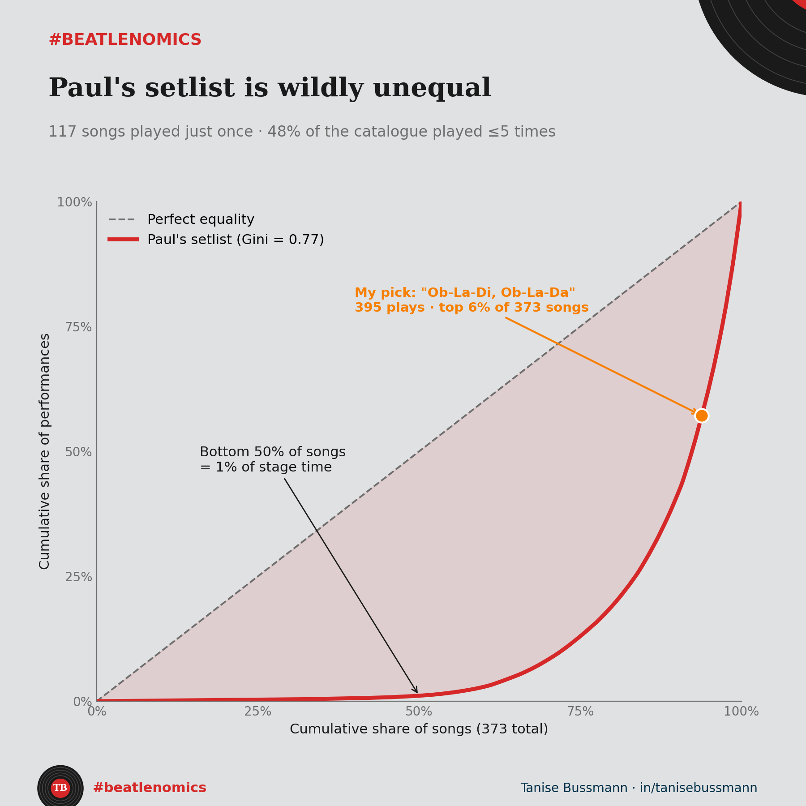

Paul McCartney has played 373 different songs live. Half of them account for 1% of his stage time.

I pulled his full live history, every documented show, 30,369 performances in total, and looked at how it distributes. It is one of the most lopsided catalogues I have ever measured.

The numbers are blunt. 117 songs got played exactly once. Almost half the catalogue shows up five times or fewer. The median song has been played six times in his entire career. And the top 50 songs carry 68% of every performance.

{fig-alt="Chart showing concentration of Paul McCartney's live setlist across 373 songs"}

Put it on a Lorenz curve and the Gini comes out at 0.77. I measure market concentration for a living, and that number is higher than the income inequality of any country on earth.

There is an era story underneath it. The Beatles years lasted about eight. His solo and Wings career runs past fifty. Yet Beatles songs still take 65% of his stage time. Eight years of output drive two thirds of what he plays. Supply and demand point in opposite directions.

This is demand concentration, the same shape that runs through streaming, publishing, and box office. A few legacy assets carry the whole catalogue, and anything new has to compete with a back catalogue that never depreciates. People do not pay for the newest song. They pay for the one that became canon.

The uncomfortable part, if you build anything creative, is that your catalogue's value does not spread evenly across what you make. It clusters, hard. The real question is not how much you produce. It is whether you ever make another thing that climbs into the head of the curve.

My favourite Beatles song, Ob-La-Di Ob-La-Da, sits in the top 6%. Good company, as it turns out.

A note on the data. This comes from publicly documented setlists on [setlist.fm](https://www.setlist.fm). The counts are fan logged, so read them as floors, not exact totals. The Gini is computed across all 373 songs.

So what is your read. Is McCartney leaving money on the table by underplaying fifty years of solo work, or is giving people the hits simply the rational move?

*Code and data: [github.com/taniseb/beatlenomics](https://github.com/taniseb/beatlenomics)*
