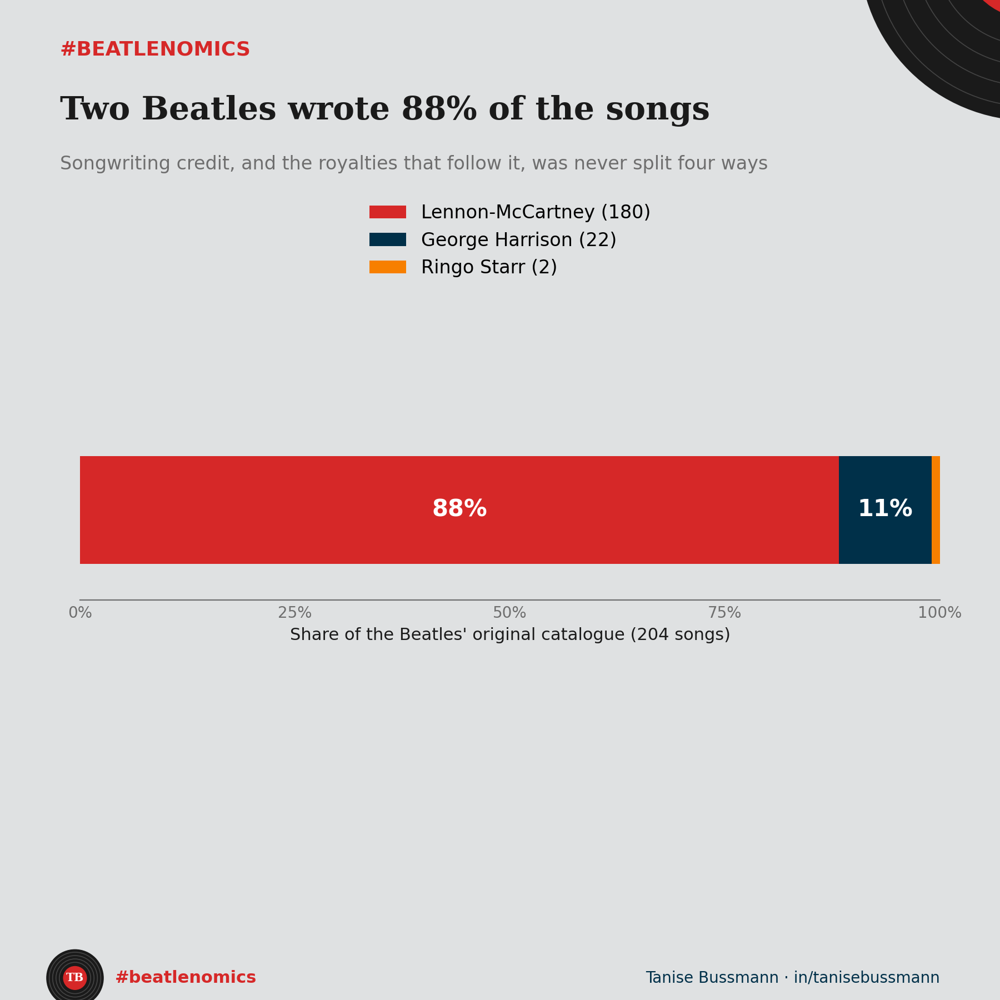

There were four Beatles. Two of them wrote 88% of the songs.

I went through the catalogue and counted the credits. Lennon and McCartney are on roughly 180 songs. George Harrison wrote about 22. Ringo Starr wrote 2. So of every original the band recorded, almost nine in ten carry the Lennon-McCartney name.

Here is why that goes beyond trivia. A songwriting credit is its own income stream. When the band plays a show, the performance fees get split. But the writer's share of a song's royalties goes to the people credited as writers, not to everyone who played on it. For Lennon-McCartney songs, that meant John and Paul, not George and Ringo.

That gap shaped the band. Harrison spent years frustrated that his songs had to fight for room on each album. When he finally got the space, he turned in "Something" and "Here Comes the Sun," two of the most covered songs the Beatles ever released. The talent was never the constraint. Access to the catalogue was.

And here is the twist that makes the point sharper. Writing a song and owning it are two different rights. Lennon and McCartney wrote the catalogue, then lost control of who owned it. The publishing company was sold, changed hands, and in 1985 Michael Jackson bought it for 47.5 million dollars, outbidding McCartney for his own songs. So even the writers did not end up holding their work — [that saga gets its own post](07-quem-e-dono.qmd).

This is the part people miss about creative businesses. Value does not accrue to whoever is in the room. It accrues along the rights, and the rights were never split evenly.

I look at concentration for a living. In any market, two of four players holding 88% of the output would catch my eye. The Beatles just made that concentration sound like the best decade of music ever recorded.

So what is your read. Was the Lennon-McCartney lock fair to Harrison, or simply the deal he agreed to?

*Code and data: [github.com/taniseb/beatlenomics](https://github.com/taniseb/beatlenomics)*
