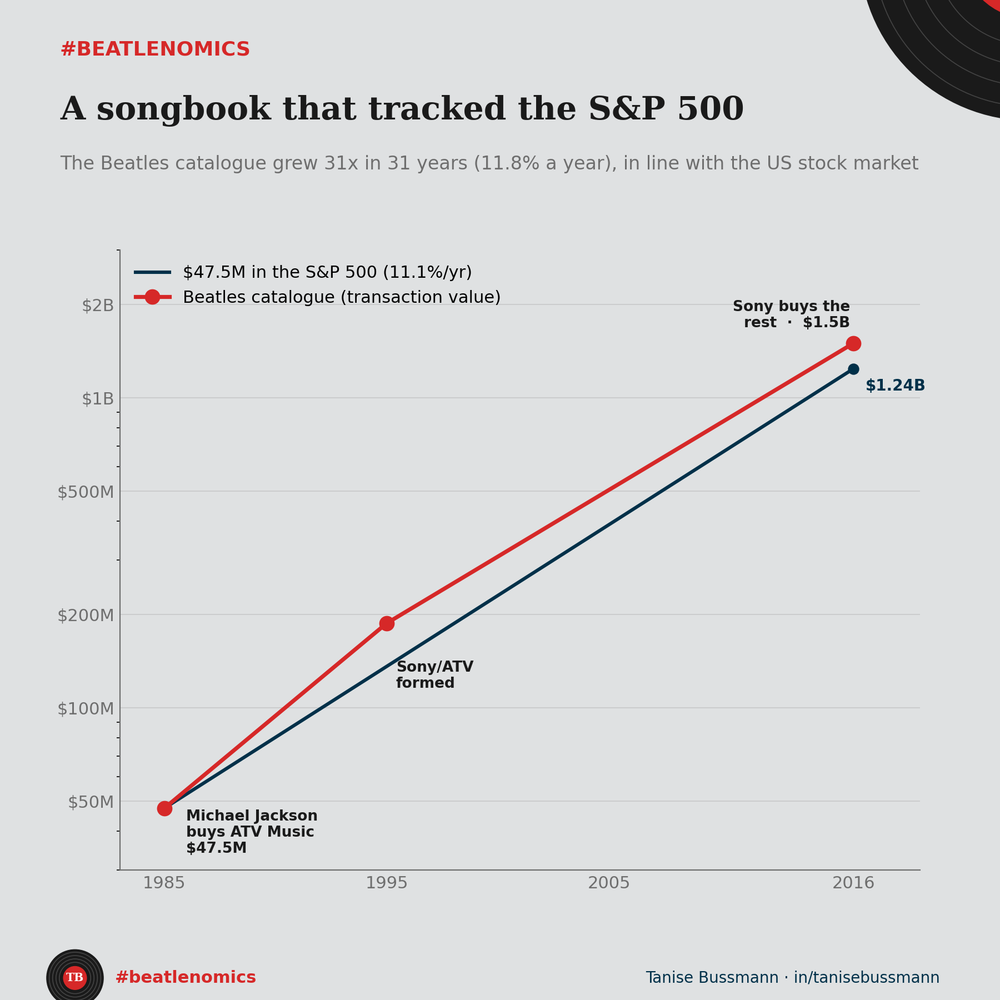

In 1963, Lennon and McCartney signed their songs to a company called Northern Songs. They were 22 and 21. By 1969, they had lost control of the catalogue entirely. By 1985, someone who never wrote a single Beatles song owned it.

I tracked every transaction. Here is what the ownership of the most valuable songbook in popular music looks like as a financial asset.

**1963.** Northern Songs is created. Lennon and McCartney are minority shareholders in their own work. Publisher Dick James and manager Brian Epstein hold the majority.

**1969.** After Epstein's death, Dick James sells his shares to Lew Grade's ATV for 1.5 million pounds, without telling Lennon or McCartney. The Beatles try to buy back control. They fail. They sell their remaining shares for 3.5 million pounds. ATV ends up with 92%. Total implied valuation of Northern Songs at the time of ATV's bid: roughly 9.5 million pounds.

**1985.** Michael Jackson buys ATV Music for 47.5 million dollars. The catalogue contains about 4,000 songs. 251 of them are Lennon-McCartney compositions. That works out to roughly 11,900 dollars per song across the whole catalogue, or 189,000 dollars per Beatles song if you allocate the entire price to just the 251. McCartney wanted to buy it. He was outbid on his own songs.

**1995.** Facing financial pressure, Jackson merges the catalogue with Sony's publishing arm. Sony/ATV is born. Jackson keeps 50%.

**2016.** Seven years after Jackson's death, his estate sells the remaining 50% to Sony for 750 million dollars. The implied valuation of the full catalogue: 1.5 billion.

Now here is where it gets interesting for anyone who thinks about returns.

47.5 million in 1985 became 1.5 billion in 2016. That is a 31x increase in 31 years, which works out to 11.8% compound annual growth in nominal terms. Adjusted for inflation, the real return is about 8.9% per year.

How does that compare? The S&P 500 returned roughly 11.1% nominal over the same period. Gold returned 4.5%. US housing appreciated at about 3.5% annually in real terms.

So the Beatles catalogue performed roughly in line with the US stock market, beat gold by a wide margin, and crushed real estate. As an asset class, a songbook written by four men from Liverpool in the 1960s tracked the performance of the 500 largest American companies for three decades.

The price per song tells the story even more clearly. In 1985, each song in the ATV catalogue was worth about 11,900 dollars. By 2016, that same song was worth roughly 375,000 dollars. A 32x appreciation per composition.

But here is the part that still surprises me. In 2018, McCartney began using a provision in US copyright law that lets writers of pre-1978 songs reclaim their publishing rights after 56 years. He filed for 267 songs and reached a confidential settlement with Sony in 2017. More than fifty years after losing control, the law gave him a path back in.

The writers created the value. An investor captured the return. And eventually, a clause in copyright law did what no business negotiation could. That is the economics of intellectual property in one catalogue.

*Code and data: [github.com/taniseb/beatlenomics](https://github.com/taniseb/beatlenomics)*
