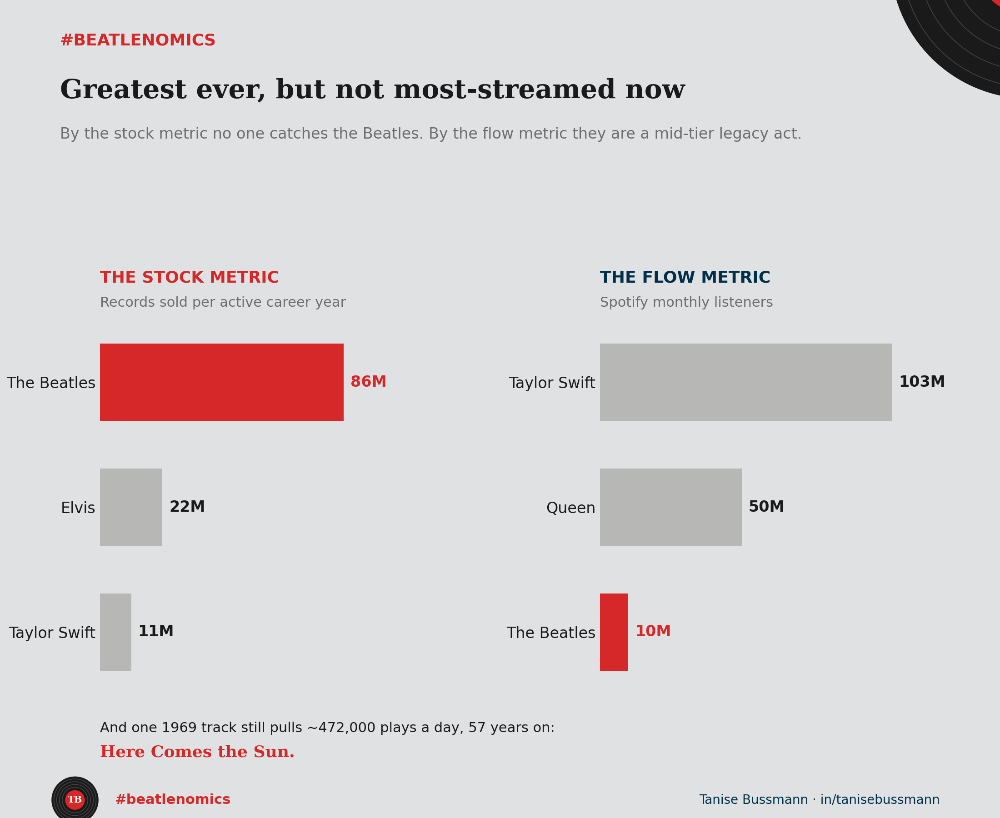

The Beatles sold 600 million records. The best-selling act in music history, by a wide margin.

On Spotify, they have about 26 billion total streams and roughly 10 million monthly listeners. Taylor Swift has over 100 billion streams and 103 million monthly listeners. The Beatles are not in the top 50 most-streamed artists on the platform. They are not even the most-streamed classic rock band. That title goes to Queen, with 29 billion streams and 50 million monthly listeners.

So when we say the Beatles never get old, what exactly are we measuring? I ran the numbers three different ways.

**First, sales per year of active career.** The Beatles were together for seven years, 1963 to 1970. In that window, they sold 600 million records — 86 million per year. Elvis, over a 23-year career, averaged 22 million per year. Taylor Swift, across 18 years, averages about 11 million per year. By annual output rate, the Beatles are not just the biggest. They operated at 4x the pace of Elvis and 8x the pace of Taylor Swift.

**Second, streams per original song.** The Beatles recorded roughly 213 original compositions. Their 26 billion Spotify streams spread across those tracks give an average of about 122 million streams per song. Queen, with approximately 180 songs and 29 billion streams, averages 162 million per song — a higher per-song streaming density. Part of the explanation is "Bohemian Rhapsody," which got a second life from the 2018 film and sits at over 2 billion streams alone.

**Third, the time disadvantage.** The Beatles catalogue was not available on any streaming platform until December 24, 2015. That means their 26 billion streams were accumulated in roughly 10 years, not the 18 years Spotify has existed — about 2.5 billion plays per year. Taylor Swift's is about 6.7 billion per year, a 2.7 to 1 ratio. Significant, but smaller than the 10 to 1 gap in monthly listeners would suggest.

And then there is "Here Comes the Sun." Written by George Harrison in 1969. It has 1.8 billion Spotify streams — the first song from the 1960s to cross one billion plays on any streaming platform. It averages roughly 472,000 plays per day, every day, 57 years after it was recorded. No algorithmic playlist strategy, no TikTok campaign, no coordinated release. Just a track that people keep pressing play on.

Here is what the data actually says. The Beatles dominated an era when success meant selling a physical object. Streaming measures something different: not the decision to buy, but the decision to listen again. Sales are a stock metric — they accumulate and never go down. Streams are a flow metric — they measure ongoing, current demand.

By the stock metric, no one will ever catch the Beatles. 600 million records in seven years is a number that belongs to a format that no longer exists. By the flow metric, they are a mid-tier legacy act on Spotify, outperformed by Queen, by Coldplay, by artists who are still releasing music and feeding the algorithm.

But 472,000 daily plays of a 1969 track is not nostalgia. That is a song that still solves a problem for listeners, 57 years later. The catalogue ages. The best songs do not.

Greatest ever? Almost certainly. Most listened to right now? Not even close. That gap is the most honest thing data can tell you about how culture ages.

*Code and data: [github.com/taniseb/beatlenomics](https://github.com/taniseb/beatlenomics)*
