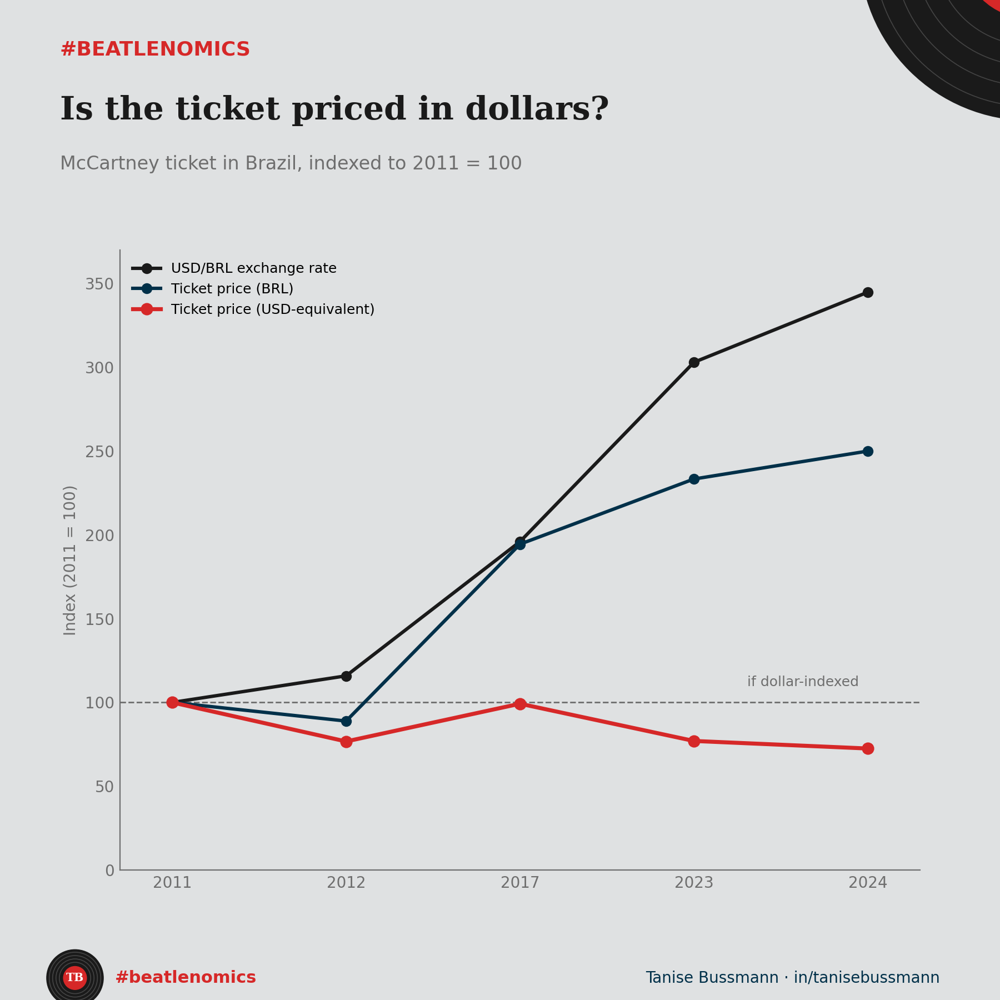

I had this filed as a 2017 exchange-rate story: the dollar spiked, the ticket spiked, case closed. Then I stopped using the annual average dollar and used the rate on the actual show date. The story fell apart.

Here is the setup. McCartney has played Brazil in five different years since 2011, four different cities, three different seat category names, all converted to the cheapest full-price ticket available, excluding any tier flagged as restricted-view or otherwise ambiguous. Ticket prices, in reais, went from R$180 to R$450, up 150%. Over the same window, the dollar went from R$1.62 to R$5.59, up 245%. Simple question: does the ticket track the dollar?

{fig-alt="Chart comparing Paul McCartney ticket prices in Brazil, in reais and dollars, against the exchange rate across five shows"}

Convert every price to its dollar equivalent on the show date and the answer is no, and not in the direction you would guess. The dollar price was $111 in 2011. By 2024 it was $80, down more than a quarter while the reais price rose one and a half times over.

I had a backup theory. Maybe 2017 was the year the dollar explains, even if the trend does not. That also does not survive the exact date. The exchange rate in 2017 was R$3.18, nowhere near a peak, well below 2023 and 2024. What actually happened in 2017 is that the dollar price landed close to 2011's, purely by coincidence of two different currencies moving at different speeds.

Five price points across thirteen years. That is the whole series, and two prices sitting near each other is not a mechanism. It is two numbers that happened to land close, and the exchange rate does not explain either one.

This matters beyond the anecdote. There were two real confounds during this window: a 2013 law standardizing the half-price student and elderly discount nationwide, which could push the full-price ticket up if promoters raised it to offset the mandatory discount, and installment terms that vary by promoter and were never documented consistently enough to isolate. Either one could be doing real work in the reais series. The exchange rate, on its own, is doing none.

Same trap as pegging a price model to one FX shock: the year that fits the story is not the mechanism. The line-up was real. The five-point series it was built on was not enough to test it.

What is the last time a single well-timed data point convinced you of a trend that the rest of the series quietly contradicted?
