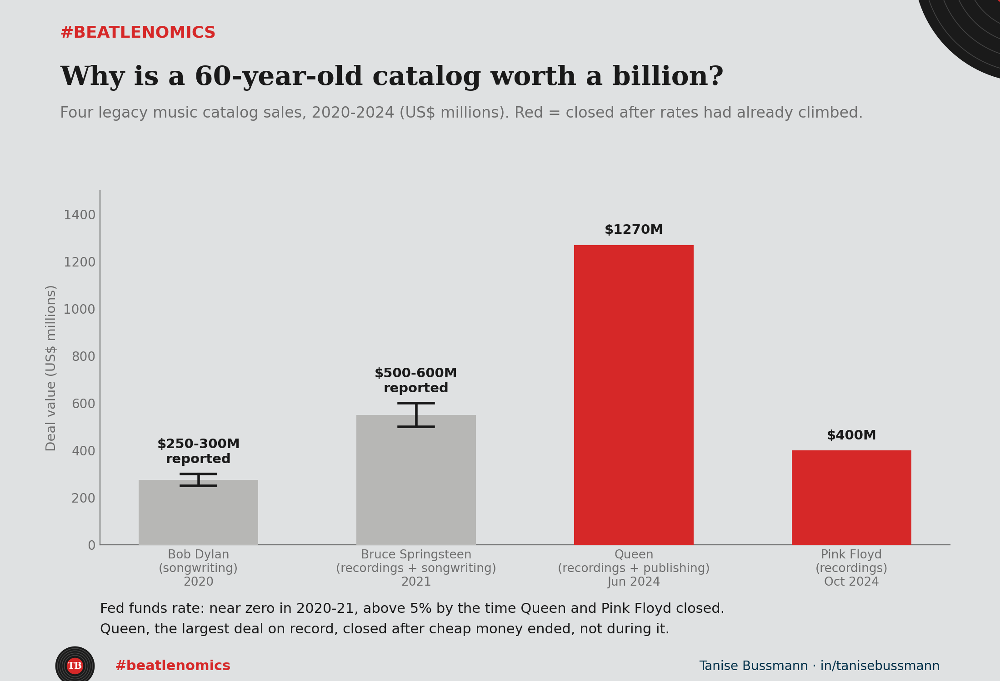

In June 2024, Sony Music, backed by an outside investor, agreed to pay 1.27 billion dollars for a catalog of songs going back to the early 1970s. Nobody involved expects a new verse from Freddie Mercury. So what did Sony actually buy?

{fig-alt="Timeline chart of four legacy music catalog sales from 2020 to 2024, showing deal values in US dollars, with Queen and Pink Floyd highlighted as closing after interest rates had already climbed"}

Queen's catalog was the headline, but it was one of four deals like it in four years, each one different in what actually changed hands. Bob Dylan sold his songwriting catalog, the compositions, not the recordings, to Universal for a reported 250 to 300 million in 2020. Bruce Springsteen sold his recordings and songwriting to Sony for north of 500 million in 2021. Pink Floyd sold their recordings and name rights to Sony for 400 million in 2024, four months after Queen, following years of the band's own members blocking each other.

Four legacy acts, four buyers with deep pockets, all in a four-year window. That clustering lines up with a period when borrowing was close to free, in 2020 and 2021, and a predictable royalty stream is exactly the kind of asset that gets bid up when cheap money is chasing safe yield. The theory has an obvious hole, though: Queen and Pink Floyd closed in 2024, well after rates had already climbed. If interest rates were the whole story, those two deals should have gotten cheaper, not bigger.

They did not. Queen's price is the largest on record, arriving into a higher-rate world than Springsteen's or Dylan's. The more interesting read is not that cheap money caused the wave. It is that the wave outlived the cheap money. Once streaming made royalty income countable enough to price like a bond, once a handful of these deals set a precedent for what a legacy catalog is worth, the appetite for buying that yield did not need rates to stay low to keep going.

Streaming looks like the load-bearing change here: it turned "people still like this song" into a quarterly number a buyer could underwrite. The rate environment set the pace at the start. It stopped being the constraint once the asset class proved itself.

What happens to catalog prices the next time rates actually move?

#beatlenomics #musicbusiness #assetpricing #financialhistory #datascience #TheBeatles
