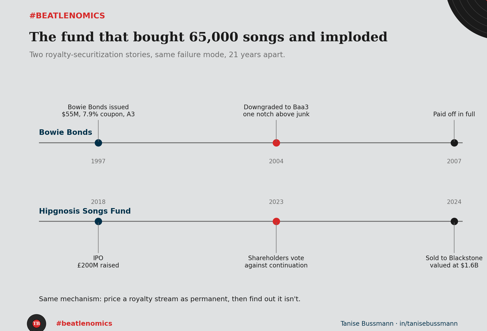

In 1997, David Bowie turned his own future royalties into a bond. Investors bought ten years of his back catalog's cash flow upfront, at a 7.9% coupon, rated A3. It looked like financial engineering ahead of its time, because it was.

{fig-alt="Dual timeline chart comparing Bowie Bonds (1997-2007) and Hipgnosis Songs Fund (2018-2024), both ending in the same failure mode: royalty income priced as if it were a permanent, fixed cash flow"}

It also came with a warning nobody priced in at the time. Royalty income is not a fixed coupon. It is a bet on how much people will keep listening, and for how long, on terms nobody can fully see from year one. By 2004, weak record sales and a downgrade to the entity backing the deal dragged the bond down to one notch above junk. It still got paid off in full in 2007, but the rating told the real story: the cash flow was never as safe as the structure implied.

Two decades later, a much bigger version of the same idea did the same thing, faster and in public. Hipgnosis Songs Fund floated on the London Stock Exchange in 2018 with one pitch: buy song catalogs, package the royalties, sell the yield to anyone with a brokerage account. It grew to touch rights connected to roughly 65,000 songs and raised about 1.3 billion pounds in total.

Shareholders voted against continuing the fund in October 2023, forcing a sale process. An independent review had already challenged how the fund's own manager was projecting its revenue. By July 2024, the company had sold itself to Blackstone.

Same failure mode both times. Price a royalty stream as if it will hold its shape forever, and the valuation depends entirely on that assumption surviving contact with reality. Bowie's assumption cracked when the CD market did. Hipgnosis's cracked when someone finally checked the growth story against the growth.

This is not a music story. It is the discounted-cash-flow story: the number on the spreadsheet is only as good as the persistence assumption underneath it, and persistence is the one input nobody can actually verify in advance.

#beatlenomics #assetpricing #musicbusiness #finance #datascience #TheBeatles
