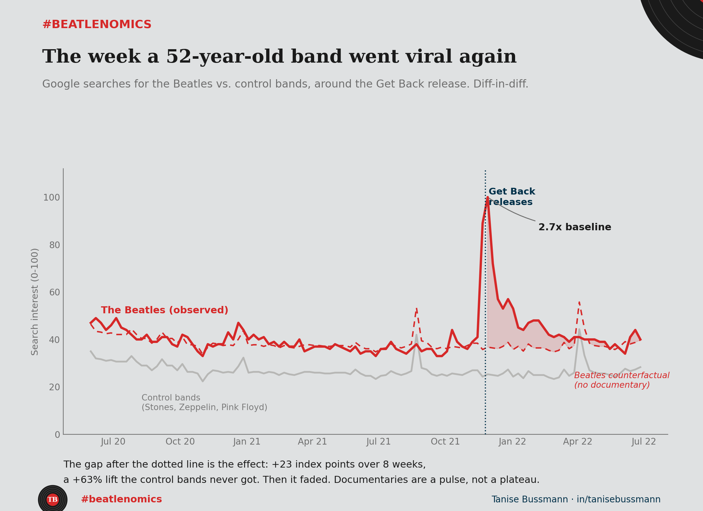

In November 2021, searches for a band that broke up in 1970 nearly tripled in a single week. I wanted to know one thing. Was that the documentary, or just Christmas?

The band is the Beatles. The documentary is *Get Back*, eight hours of restored 1969 footage that Peter Jackson dropped on Disney+ over three days, the 25th to the 27th of November. Google searches for the Beatles jumped to 2.7 times their normal level the same week.

Here is the trap. December always lifts music searches. Gifts, playlists, nostalgia, family. A simple before-and-after would hand the documentary a spike that partly belongs to the calendar. That is correlation wearing the costume of an effect, and it is the most common mistake in measurement.

So I ran a **diff-in-diff**. The idea is simple. Find things that ride the same seasonal wave but had no documentary, and let them tell you what the Beatles would have done anyway. My control group was three legacy bands with no shock in the window: the Rolling Stones, Led Zeppelin, Pink Floyd. If Christmas alone drove the spike, they should spike too.

They did not. Before *Get Back*, the four bands moved together closely enough to trust the comparison — that co-movement is the parallel trends assumption, and you can watch it hold in the chart. After the release, the Beatles shot up while the controls stayed flat. The distance between what happened and what the controls say would have happened is the causal effect: roughly 23 index points over the following eight weeks, a 63% lift the control bands never got.

Then the honest part. It faded. By January the Beatles were back near baseline. A documentary is a pulse, not a plateau. It buys a spike of attention, not a permanent shift in demand, and pretending otherwise is how people oversell a launch.

Now swap the documentary for an ad campaign. This is the single most common question I get asked to answer. Not "did the numbers go up after we spent the money," but "did they go up *because* of it." The gap between those two questions is worth a lot of budget, and diff-in-diff is one of the cleanest ways to close it. All it needs is a control group that shares your seasonality and skipped your treatment.

A note on the data. Google Trends is a search proxy, normalized 0 to 100, not stream counts. Three controls beat one because no single band's noise can carry the result — I tested that: the Stones had their own shock in 2021, the death of Charlie Watts. Drop them entirely and the estimate moves from 23.5 to 22.2 points. The result survives losing a third of the control group. The design is the point, not the decimal.

So what would you have used as the control group?

*Code and data: [github.com/taniseb/beatlenomics](https://github.com/taniseb/beatlenomics)*
