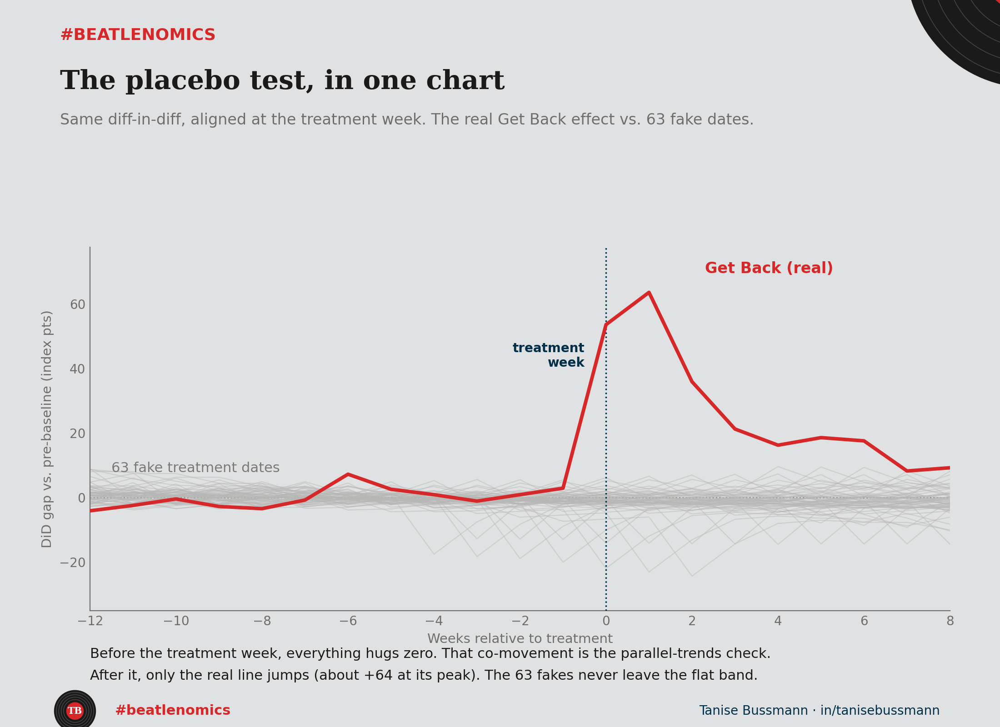

On Monday I showed that a documentary made a band that broke up in 1970 nearly triple its Google searches. Today I tried to prove that finding was fake. Here is what happened.

A number is not trustworthy because you found it. It is trustworthy because you tried to break it and could not. That second step is the one most people skip, and it is the one that separates a serious analysis from a pretty chart.

So I ran the **placebo test**. My [diff-in-diff](c3-get-back-did.qmd) said *Get Back* lifted Beatles searches by 23 index points. Fine. But what if my method just manufactures effects? What if it would find a lift anywhere I pointed it? There is a clean way to check. Point it at a moment when nothing happened.

I took the exact same model and moved the treatment date to 63 other weeks. Weeks with no documentary, no reunion, no news. If the method is honest, those fake dates should come back near zero. If it invents effects, they should light up like the real one did.

They came back near zero. All 63 of them clustered around no effect, while the real *Get Back* estimate sat more than nine standard deviations away, alone out in the tail. Not one fake date came close. Then I ran it the other way, pretending a control band was the treated one on the real release date. Near zero again. The effect refused to be faked, from every angle I tried.

Here is the lesson hiding inside the lesson. The only fake dates that showed anything at all were the ones parked right after the real spike, and those were not clean nulls — they were catching the tail of the true effect. A placebo is only as good as the window you give it. Run it carelessly and it will lie to you too.

Now take this out of music. It is the question to ask anyone who shows you a lift, from an ad campaign, a feature launch, a price cut. Not "how big was it." Ask "did you run it where nothing happened, and did it come back empty." If they never tried to break their own result, they do not have a result. They have a hope with a chart attached.

The job was never finding the effect. It was failing to destroy it.

So what is the last number you trusted that nobody stress-tested?

*Code and data: [github.com/taniseb/beatlenomics](https://github.com/taniseb/beatlenomics)*
