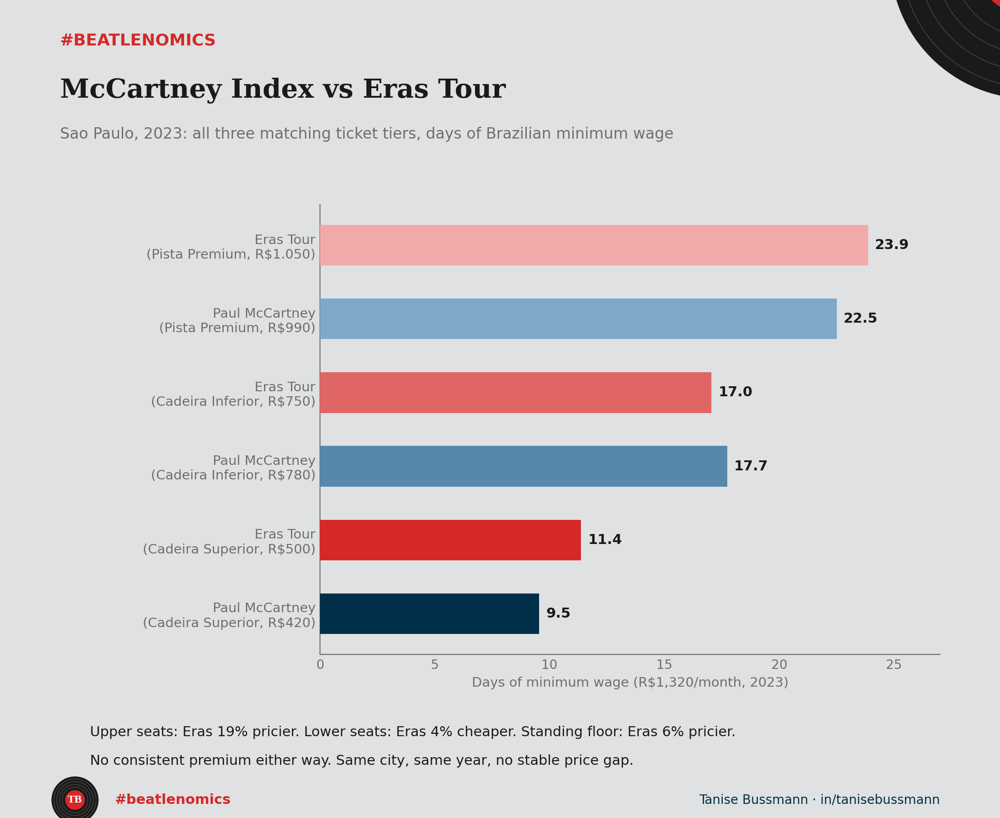

Same city. Same year. Two of the biggest tours to ever hit Brazil, two weeks apart at the same stadium. I ran both through the same index.

The rule for the McCartney Index has always been the same: cheapest ticket, full price, with no restricted view, converted into days of Brazilian minimum wage. It strips out currency, inflation, and hype, and leaves one honest number: how much of a month's minimum wage a ticket actually eats.

Both shows sold three matching tiers, same names, same venue, so I ran all three instead of picking one.

Cheapest seat, upper tier: McCartney 9.5 days of minimum wage, Eras Tour 11.4. Eras 19% pricier. Middle tier, lower seating: McCartney 17.7 days, Eras Tour 17.0. Eras 4% cheaper. Standing floor, the most expensive ticket either show sold: McCartney 22.5 days, Eras Tour 23.9. Eras 6% pricier again.

{fig-alt="Bar chart comparing Paul McCartney and Eras Tour ticket prices in Sao Paulo, 2023, across three seat tiers, measured in days of Brazilian minimum wage"}

Up, down, up. Neither artist is consistently more expensive. Pick any two of the three tiers and you can tell a clean story about which one charges more. Look at all three and the clean story disappears.

Neither artist did anything wrong here. Different production costs, different demand curves, different seating maps. The honest finding is the unglamorous one: two of the biggest tours in the world landed within 6% of each other on the expensive tickets and 19% apart on the cheap ones, with no consistent premium either way.

Burgernomics for concerts works because it refuses to let currency or fame do the explaining. It just asks how many days of your month one night costs, tier by tier, not just the tier that makes the best headline.

What would your own local show look like on this scale?
